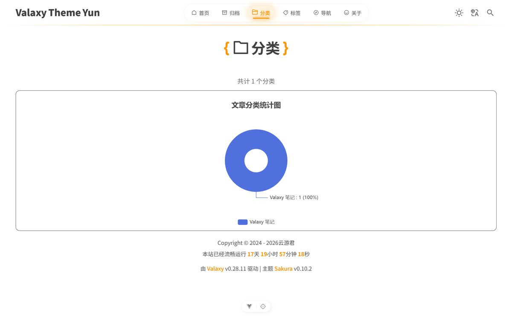

<a name="top"></a>

<p align="center">
  <h1 align="center">threetwoa-blogs</h1>
  <p align="center"><em>A Valaxy static blog with Sakura theme and progressive UI enhancements</em></p>
  <p align="center">基于 Valaxy + Sakura 主题的静态博客，包含分类/标签/归档图表、公告栏、随机文章、加载动画、图片灯箱、友链、网址导航、页脚倒计时、搜索修复等 8 个阶段的美化与功能增强</p>
</p>

<p align="center">
  
</p>

<!-- 入口与状态徽章 -->
<p align="center">
  <a href="https://github.com/Aafff623/threetwoa-blogs/actions/workflows/gh-pages.yml"></a>
  <a href="https://github.com/Aafff623/threetwoa-blogs/stargazers"></a>
  
</p>

<p align="center">
  <a href="#功能">功能</a> ·
  <a href="#演示">演示</a> ·
  <a href="#快速开始">快速开始</a> ·
  <a href="#架构">架构</a> ·
  <a href="#文档">文档</a> ·
  <a href="#更新日志">更新日志</a> ·
  <a href="#许可证">许可证</a>
</p>

---

## 🤔 为什么需要 threetwoa-blogs

Valaxy 是一款优秀的 Vue 静态博客框架，但默认主题的功能和视觉风格往往无法满足个人博客的个性化需求。对于希望拥有以下体验的博主来说，一个经过系统美化、功能逐步增强的博客模板可以显著降低折腾成本：

- 希望分类、标签、归档页面有数据可视化图表，而不是纯列表
- 希望首页有公告栏、随机文章轮播等动态模块
- 希望页面加载、图片预览、友链、留言板、导航页等交互更精致
- 希望搜索功能稳定可用，页脚能展示站点运行时长

**threetwoa-blogs 的核心边界：**

| 模块 | 职责 |
| ---- | ---- |
| `valaxy.config.ts` | Valaxy 框架/主题配置：主题、UnoCSS safelist、插件、构建选项 |
| `site.config.ts` | 站点元数据：URL、语言、标题、社交链接、搜索、赞助 |
| `pages/` | 文件系统路由：文章、归档、分类、标签、友链、导航、搜索等页面 |
| `components/` | 自动注册的自定义组件，覆盖或扩展主题组件 |
| `styles/` | 自定义样式与 CSS 变量，覆盖 Sakura 主题默认风格 |

```text
Markdown 文章 → Valaxy 构建 → Vite/Vue SSG → 静态站点（GitHub Pages / Vercel / Netlify / Docker）
```

<p align="right">(<a href="#top">回到顶部</a>)</p>

---

## ✨ 功能

| 阶段 | 功能 | 说明 |
| ---- | ---- | ---- |
| **Stage 1** | 分类 / 标签 / 归档可视化 | 使用 ECharts 实现环状图、折线面积图、柱状图 |
| **Stage 2** | 首页公告栏 + 随机文章 | 可配置多组公告，首页随机展示文章轮播 |
| **Stage 3** | 页面加载动画 | 基于 FOUC Guard 的加载过渡效果 |
| **Stage 4** | 图片灯箱预览 | 文章内图片点击放大查看 |
| **Stage 5** | 友链页面美化 | 卡片式友链展示 + 留言板 |
| **Stage 6** | 留言板信封展开效果 | 交互式信封展开动画 |
| **Stage 7** | 网址导航页面 | 站点导航 + 随机网站跳转抽卡 |
| **Stage 8** | 页脚运行倒计时 + 搜索修复 | 实时显示站点运行时长，修复 Fuse 搜索初始化问题 |

**场景匹配：**

| 方向 | threetwoa-blogs 如何匹配 |
| ---- | ------------------------ |
| 个人技术博客 | 文章 + 标签/分类/归档体系，RSS 与搜索 |
| 视觉向博客 | Sakura 主题 + 图表 + 动画 + 灯箱 |
| 多域名部署 | 内置 GitHub Pages / Vercel / Netlify / Docker 配置 |

<p align="right">(<a href="#top">回到顶部</a>)</p>

---

## 🎬 演示

| 页面 | 说明 | 预览 |
| ---- | ---- | ---- |
| 首页 | 公告栏、随机文章、文章列表、页脚倒计时 | [Live](https://daily.yybb.us/) |
| 导航页 | 站点导航 + 随机网站跳转 | [Live](https://daily.yybb.us/navigation) |
| 分类页 | ECharts 环状图 / 列表视图 | [Live](https://daily.yybb.us/categories) |

### Showcase

| | | |
|:---:|:---:|:---:|
| [](assets/images/readme/screenshot-home.jpg)<br><br>**首页**<br>公告栏与文章列表<br>[查看 Live](https://daily.yybb.us/) | [](assets/images/readme/screenshot-navigation.jpg)<br><br>**导航页**<br>网址导航与随机跳转<br>[查看 Live](https://daily.yybb.us/navigation) | [](assets/images/readme/screenshot-categories.jpg)<br><br>**分类页**<br>ECharts 可视化<br>[查看 Live](https://daily.yybb.us/categories) |

<p align="right">(<a href="#top">回到顶部</a>)</p>

---

## 🚀 快速开始

### 30 秒本地预览

```bash
git clone https://github.com/Aafff623/threetwoa-blogs.git
cd threetwoa-blogs
pnpm install
pnpm dev
```

打开 [http://localhost:4859](http://localhost:4859)。

### 常用命令

| 命令 | 作用 |
| ---- | ---- |
| `pnpm dev` | 启动开发服务器 |
| `pnpm build` | 构建 SSG 站点到 `dist/` |
| `pnpm build:spa` | 构建 SPA 版本 |
| `pnpm serve` | 预览生产构建 |
| `pnpm rss` | 生成 RSS 订阅 |
| `pnpm fuse` | 生成 Fuse 搜索索引 |

### 生产构建验证

```bash
pnpm build
pnpm serve
```

预期结果：
- `dist/` 目录生成完整静态站点
- `pnpm serve` 后访问 `http://localhost:4173/`（默认）可正常浏览

<p align="right">(<a href="#top">回到顶部</a>)</p>

---

## 🏗️ 架构

```text
┌─────────────────────────────────────────────────────────────┐
│                         静态站点输出                            │
│                     (dist/ → GitHub Pages)                    │
└───────────────────────────┬─────────────────────────────────┘
                            │ Valaxy CLI (build --ssg)
┌───────────────────────────▼─────────────────────────────────┐
│                     Valaxy Framework                          │
│  文件系统路由 · 组件自动注册 · Vite · Vue 3 · UnoCSS           │
└───────────────────────────┬─────────────────────────────────┘
                            │
┌───────────────────────────▼─────────────────────────────────┐
│                   valaxy-theme-sakura                         │
│  首页 · 文章页 · 列表页 · 搜索 · 布局系统                      │
└───────────────────────────┬─────────────────────────────────┘
                            │ 组件覆盖 / 主题配置
┌───────────────────────────▼─────────────────────────────────┐
│                      用户自定义层                              │
│  components/ · pages/ · layouts/ · styles/ · valaxy.config.ts │
└─────────────────────────────────────────────────────────────┘
```

| 层 | 技术 | 说明 |
| -- | ---- | ---- |
| 框架层 | Valaxy 0.28.11 | 静态博客生成、路由、构建 |
| 主题层 | valaxy-theme-sakura | Sakura 视觉风格与基础页面 |
| 扩展层 | Vue 3 / TypeScript / UnoCSS | 自定义组件、布局覆盖、样式变量 |
| 可视化 | ECharts 6.x | 分类/标签/归档图表 |
| 部署层 | GitHub Actions / Vercel / Netlify / Docker | 多平台静态托管 |

**关键原则：**

- **配置分离**：`valaxy.config.ts` 管框架/主题，`site.config.ts` 管站点元数据
- **组件覆盖优先**：通过 `components/` 和 `layouts/` 覆盖主题默认组件，避免改源码
- **图标安全清单**：动态 Iconify 图标必须加入 `valaxy.config.ts` 的 `safelist`
- **搜索索引**：发布前运行 `pnpm fuse` 生成 Fuse 搜索数据

<p align="right">(<a href="#top">回到顶部</a>)</p>

---

## 🛠️ Built With

* [](https://valaxy.site/)
* [](https://vuejs.org/)
* [](https://vitejs.dev/)
* [](https://unocss.dev/)
* [](https://www.typescriptlang.org/)
* [](https://echarts.apache.org/)

<p align="right">(<a href="#top">回到顶部</a>)</p>

---

## 🗺️ 路线图

| 阶段 | 状态 | 要点 |
| ---- | ---- | ---- |
| **Stage 1-7** | ✅ 完成 | 分类/标签/归档图表、公告栏、随机文章、加载动画、图片灯箱、友链、留言板、导航页 |
| **Stage 8** | ✅ 完成 | 页脚运行倒计时、Fuse 搜索修复 |
| **Stage 9** | 🔜 待规划 | 相册页面，支持 WebDAV 作为图源 |
| **Stage 10** | 🔜 待规划 | 修复构建结束卡死问题 |

<p align="right">(<a href="#top">回到顶部</a>)</p>

---

## 📚 文档

| 文档 | 说明 |
| ---- | ---- |
| `CLAUDE.md` | 项目概述、常用命令、架构约定、部署说明 |
| `docs/agents/issue-tracker.md` | 本地 markdown issue tracker 约定 |
| `docs/agents/triage-labels.md` | 五个 triage 角色映射 |
| `docs/agents/domain.md` | 领域文档消费规则 |
| `docs/tutorials/` | 各阶段美化教程笔记 |
| `docs/adr/` | 架构决策记录 |

<p align="right">(<a href="#top">回到顶部</a>)</p>

---

## 📝 更新日志

| 阶段 | 日期 | 变更 |
| ---- | ---- | ---- |
| **Stage 8** | 2026-06-18 | 新增页脚运行倒计时，修复 Fuse 搜索初始化，新增 `/search` 页面 |
| **Stage 7** | 2026-06-18 | 新增网址导航页面与随机网站跳转 |
| **Stage 6** | 2026-06-18 | 留言板增加信封展开效果 |
| **Stage 5** | 2026-06-18 | 友链页面卡片化，增加留言板 |
| **Stage 4** | 2026-06-18 | 增加文章图片灯箱预览 |
| **Stage 3** | 2026-06-18 | 增加 FOUC 页面加载动画 |
| **Stage 2** | 2026-06-18 | 首页公告栏与随机文章轮播 |
| **Stage 1** | 2026-06-18 | 分类/标签/归档页面 ECharts 可视化 |

完整变更见 [Git 提交历史](https://github.com/Aafff623/threetwoa-blogs/commits/master/)。

<p align="right">(<a href="#top">回到顶部</a>)</p>

---

## 🤲 贡献指南

欢迎 Issue 和 PR。

1. Fork 本仓库
2. 创建分支：`git checkout -b feat/your-feature`
3. 提交改动：`git commit -m "feat: ..."`
4. 推送分支：`git push origin feat/your-feature`
5. 创建 Pull Request

**提交规范**：遵循 [Conventional Commits](https://www.conventionalcommits.org/)，格式为 `type(scope): subject`。

<p align="right">(<a href="#top">回到顶部</a>)</p>

---

## 👥 团队

| 头像 | 姓名 | 角色 | 职责 |
| ---- | ---- | ---- | ---- |
|  | **Aafff623** | 作者/维护者 | 项目整体规划、前端美化、部署 |

<p align="right">(<a href="#top">回到顶部</a>)</p>

---

## 📄 许可证

本项目基于 [MIT](LICENSE) 许可证开源。

<p align="right">(<a href="#top">回到顶部</a>)</p>

---

Made with ❤️ by [Aafff623](https://github.com/Aafff623)
