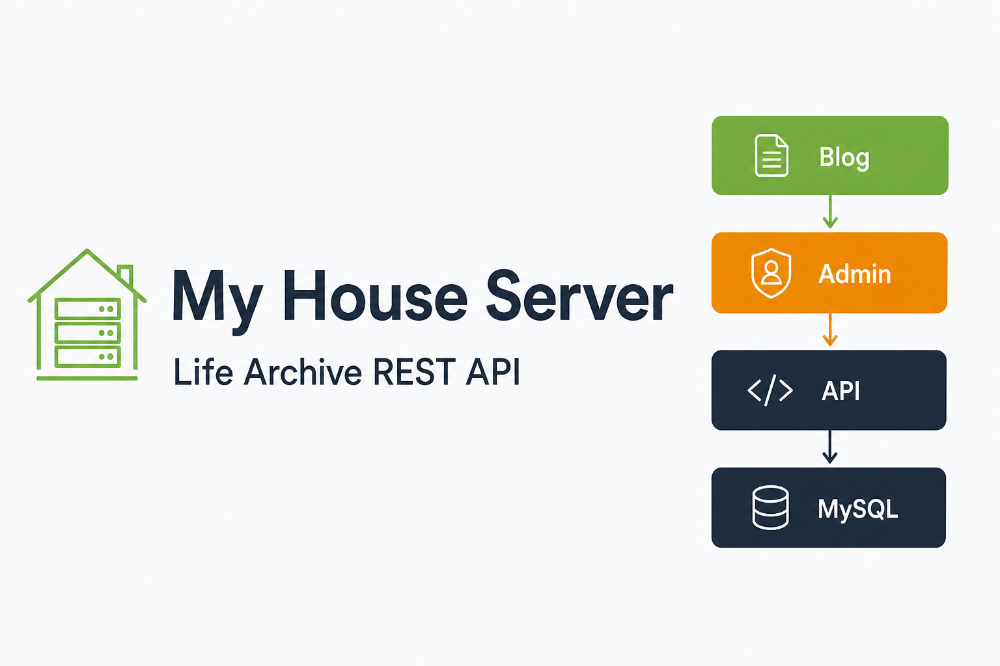
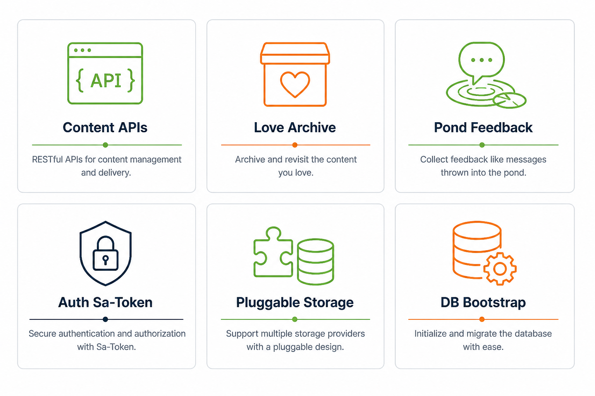
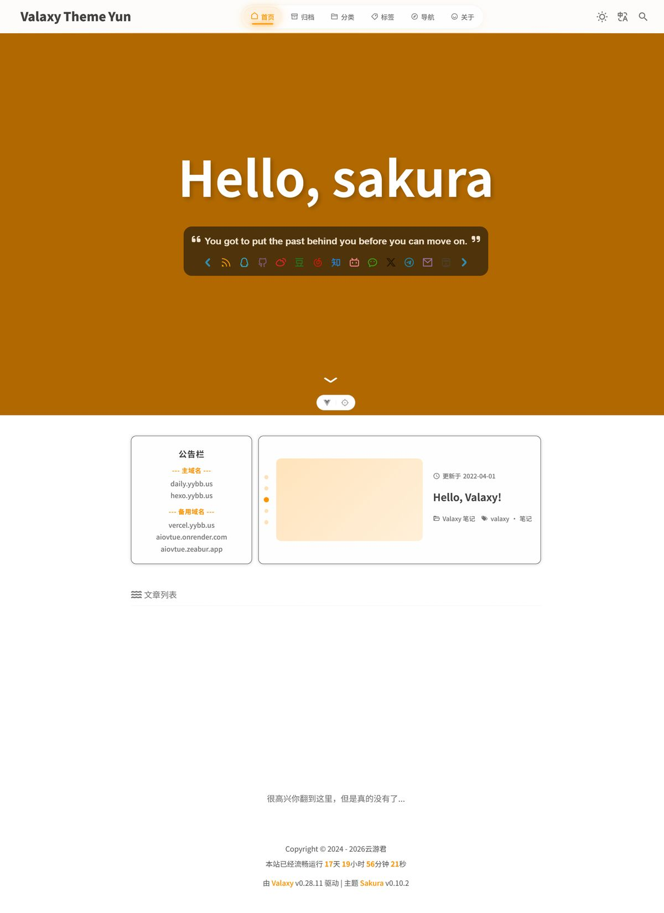
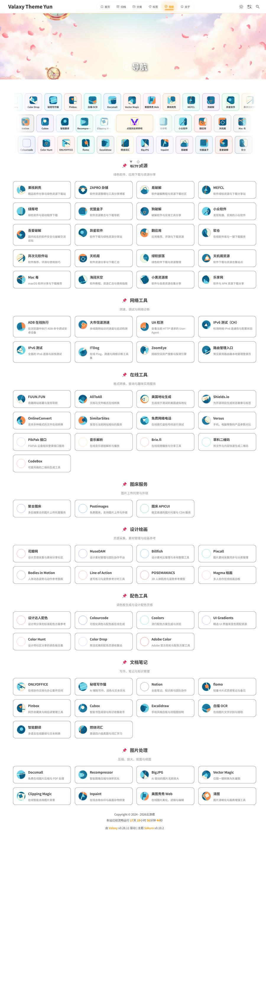
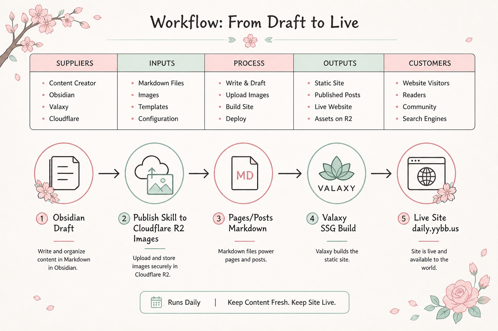
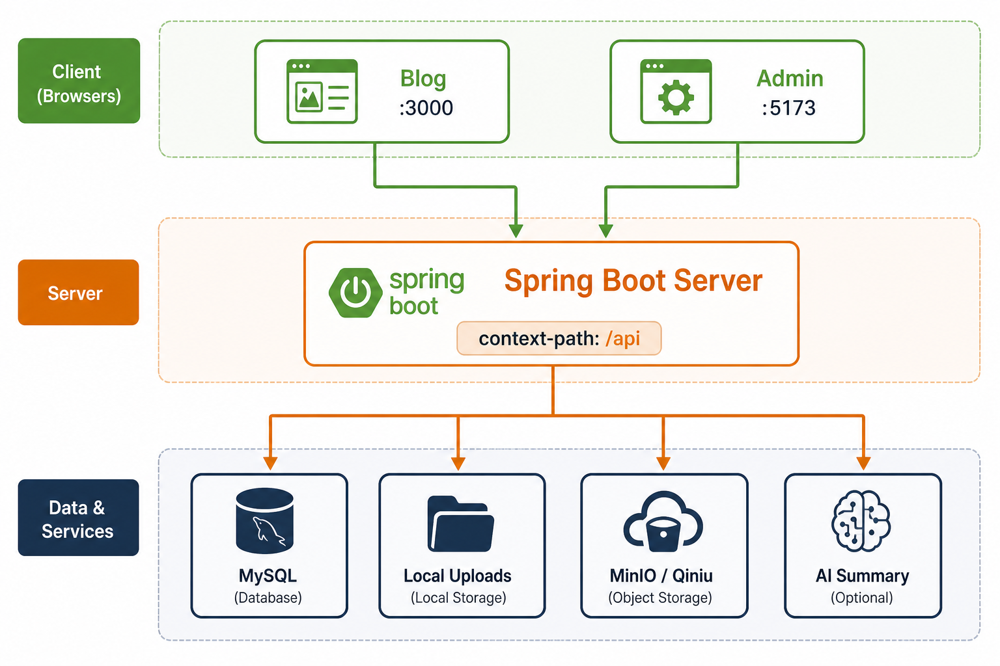
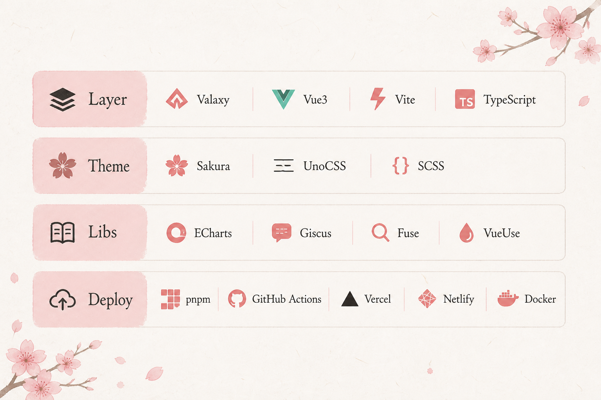
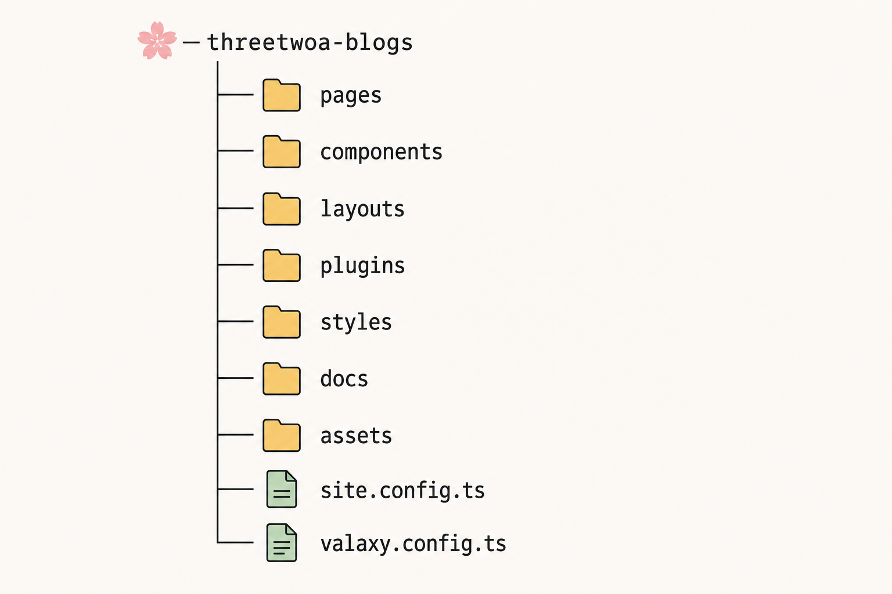

<p align="center">
  <h1 align="center">threetwoa-blogs</h1>
  <p align="center"><em>Valaxy + Sakura · 可落地的数字花园静态博客模板</em></p>
  <p align="center">基于 <strong>Valaxy + Sakura</strong> 的增强静态博客：分类/标签/归档可视化、首页动态、灯箱、友链、导航、搜索、相册与 SSG 构建兜底，配合 Obsidian → R2 → CI 的写作流水线。</p>
</p>

<p align="center">
  
</p>

<p align="center">
  <a href="https://daily.yybb.us/"></a>
  <a href="https://github.com/Aafff623/threetwoa-blogs/actions/workflows/gh-pages.yml"></a>
  <a href="https://github.com/Aafff623/threetwoa-blogs/stargazers"></a>
  
</p>

<p align="center">
  <a href="#为什么需要-threetwoa-blogs">为什么</a> ·
  <a href="#功能">功能</a> ·
  <a href="#preview">Preview</a> ·
  <a href="#showcase">Showcase</a> ·
  <a href="#从-obsidian-到博客">写作流</a> ·
  <a href="#快速开始">快速开始</a> ·
  <a href="#架构">架构</a> ·
  <a href="#技术栈">技术栈</a> ·
  <a href="#仓库结构">仓库结构</a> ·
  <a href="#路线图">路线图</a> ·
  <a href="#文档">文档</a> ·
  <a href="#许可证">许可证</a>
</p>

---

## 为什么需要 threetwoa-blogs

Valaxy + Sakura 开箱很好用，但个人站常卡在：图表归档、首页动态、灯箱、导航、搜索稳定、相册双图源、SSG 构建挂起。本仓把这些做成**可复用的增强模板**，而不是从零拼主题。

**边界（配置分离）：**

| 文件/目录 | 职责 |
| --------- | ---- |
| `site.config.ts` | Site config：URL、语言、标题、作者、社交、搜索、评论 |
| `valaxy.config.ts` | Valaxy config：主题、UnoCSS safelist、导航、Hero、插件、构建 |
| `pages/` | 文件系统路由：文章与归档/分类/标签/友链/导航/搜索/相册等 |
| `components/` · `layouts/` | 按名覆盖 Sakura，不 fork 主题源码 |
| `styles/` | 自定义样式与 CSS 变量 |
| `plugins/` | FOUC 加载动画、WebDAV 相册配置与代理 |

```text
Markdown / pages → Valaxy（Vite · Vue 3）→ Sakura → 用户扩展层 → SSG dist/ → GH Pages / Vercel / Netlify / Docker
```

---

## 功能

<p align="center">
  
</p>

### 功能演进时间线

| Stage | 主题 | 能力 |
| :---: | ---- | ---- |
| **1** | 数据可视化 | 分类 / 标签 / 归档 ECharts 图表 |
| **2** | 首页动态 | 公告栏 + 随机文章轮播 |
| **3** | 加载体验 | FOUC Guard，减少首屏白闪 |
| **4** | 交互增强 | 文章图片灯箱：缩放、滑动 |
| **5** | 友链页面 | 卡片式友链 |
| **6** | 留言板 | 信封展开动画 + Giscus |
| **7** | 网址导航 | 站点列表 + 随机跳转抽卡 |
| **8** | 搜索与页脚 | Fuse 搜索页 + 运行倒计时 |
| **9** | 相册页面 | 本地 / WebDAV、门禁 UI、时间轴 |
| **10** | 构建优化 | SSG 结束卡死兜底（`scripts/build-ssg.mjs`） |

### 场景匹配

| 方向 | 如何匹配 |
| ---- | -------- |
| 个人技术博客 | Post + Category/Tag/Archive · RSS · Fuse 搜索 |
| 视觉向博客 | Sakura + ECharts + 动画 + 灯箱 |
| 多平台部署 | GitHub Pages / Vercel / Netlify / Docker 配置内置 |

---

## Preview

本仓是**单产品博客模板**，没有组件 Gallery / demo 墙，因此 **省略 Preview 资产站**（不提供 `preview-shell.png`）。

需要边改边看 README 排版时，用根目录 **README 本地预览壳**（渲染 `README.md` 本身，不是博客站）：

```bash
# 在仓库根执行（须 HTTP；勿 file://）
python -m http.server 8094
```

打开 [http://127.0.0.1:8094/preview-readme.html](http://127.0.0.1:8094/preview-readme.html)，点「重新加载」即可刷新。

博客产品本身请用 `pnpm dev` → [http://localhost:4859](http://localhost:4859)。

---

## Showcase

推荐演示路径：

1. 首页（公告栏 · 随机文章 · 列表）→ [Live](https://daily.yybb.us/)  
2. 分类页（ECharts）→ [Live](https://daily.yybb.us/categories)  
3. 导航页（站点列表 · 抽卡）→ [Live](https://daily.yybb.us/navigation)  
4. （可选）相册 → [Live](https://daily.yybb.us/gallery)

| | | |
|:---:|:---:|:---:|
| [](assets/images/readme/showcase-home.jpg)<br><br>**首页**<br>公告栏与文章列表 | [](assets/images/readme/showcase-categories.jpg)<br><br>**分类页**<br>ECharts 可视化 | [](assets/images/readme/showcase-navigation.jpg)<br><br>**导航页**<br>网址导航与随机跳转 |

> Showcase 为真机截图；历史文件名 `screenshot-*.jpg` 仍保留，README 优先引用 `showcase-*`。

---

## 从 Obsidian 到博客

<p align="center">
  
</p>

```text
Obsidian Draft
  → publish-obsidian-post Skill
    → 配图上传 R2
    → frontmatter 规范化
    → 写入 pages/posts/<slug>.md
      → Valaxy SSG
        → 静态站点发布
```

| 仓库 | 角色 | 可见性 |
| ---- | ---- | ---- |
| `threetwoa-ob-brain` | Obsidian 知识库 / 草稿源 | Private |
| `threetwoa-blogs` | 正式发布站点 | Public |
| `threetwoa-blog-assets` | 配图托管（Cloudflare R2） | Public-read |

Skill：`.claude/skills/publish-obsidian-post.md` · 单图上传：`.claude/skills/upload-image-to-r2.md` · 目录约定：[`docs/image-assets-guide.md`](docs/image-assets-guide.md)。

---

## 快速开始

### 本地预览博客

```bash
git clone https://github.com/Aafff623/threetwoa-blogs.git
cd threetwoa-blogs
pnpm install
pnpm dev
```

打开 [http://localhost:4859](http://localhost:4859)。

### 常用命令

| 命令 | 作用 |
| ---- | ---- |
| `pnpm dev` | 开发服务器（:4859） |
| `pnpm build` | SSG → `dist/`（经 `scripts/build-ssg.mjs`） |
| `pnpm build:spa` | SPA 构建 |
| `pnpm serve` | 预览生产构建 |
| `pnpm rss` | 生成 RSS |
| `pnpm fuse` | 生成 Fuse 搜索索引 |

WebDAV 相册：复制 `.env.example` → 配置服务端密码（勿提交 `.env`）。

### 生产构建验证

```bash
pnpm build
pnpm serve
```

预期：`dist/` 完整生成，预览端口可浏览。

---

## 架构

<p align="center">
  
</p>

```text
Markdown / pages
  → Valaxy 0.28（文件系统路由 · 组件自动注册 · Vite · Vue 3）
    → valaxy-theme-sakura
      → 用户扩展（components / layouts / styles / plugins）
        → SSG dist/
          → GitHub Pages / Vercel / Netlify / Docker
```

**关键原则：**

- **配置分离**：Site config ↔ Valaxy config（禁止混称「blog config」）  
- **覆盖优先**：改 `components/` / `layouts/`，不改主题包源码  
- **图标 safelist**：动态 Iconify 类名必须进 `valaxy.config.ts`  
- **搜索索引**：发布前按需 `pnpm fuse`  
- **相册密码**：frontmatter `password` 仅门禁 UI，不可当真保密（见 ADR-0002）

领域术语与硬约束：根 [`CONTEXT.md`](CONTEXT.md)。

---

## 技术栈

<p align="center">
  
</p>

| 层 | 技术 | 说明 |
| -- | ---- | ---- |
| 框架 | Valaxy 0.28.11 | 静态博客、路由、构建（钉死） |
| 主题 | valaxy-theme-sakura | lock 当前 **0.10.2**；`package.json` 仍为 `latest`（待钉死） |
| 扩展 | Vue 3 / TypeScript / UnoCSS / SCSS | 组件覆盖与样式变量 |
| 可视化 | ECharts 6.x | 分类 / 标签 / 归档 |
| 评论 | @giscus/vue | GitHub Discussions |
| 搜索 | Fuse（Valaxy） | 本地索引 |
| 部署 | GH Actions / Vercel / Netlify / Docker | 多平台配置齐备 |
| 包管理 | pnpm（workspace 单包） | `.npmrc`：`shamefully-hoist` |

---

## 仓库结构

<p align="center">
  
</p>

```text
threetwoa-blogs/
├── pages/                 # 文件系统路由（含 posts/）
├── components/            # 主题覆盖与增强组件
├── layouts/               # gallery / navigation 等布局
├── plugins/               # FOUC · WebDAV Vite 插件
├── api/ · server/         # WebDAV 代理（Vercel + 共享实现）
├── styles/ · utils/ · types/
├── scripts/build-ssg.mjs  # SSG 挂起兜底
├── site.config.ts         # Site config
├── valaxy.config.ts       # Valaxy config
├── AGENTS.md · CLAUDE.md · CONTEXT.md · LANGUAGES.md
├── docs/                  # agents · adr · tutorials · outputs · …
├── assets/images/readme/  # README 契约图与 Showcase
└── preview-readme.*       # README 本地预览壳（端口 8094）
```

---

## 路线图

| 阶段 | 状态 | 要点 |
| ---- | ---- | ---- |
| Stage 1–10 | ✅ | 图表 → 首页动态 → FOUC → 灯箱 → 友链/留言 → 导航 → 搜索 → 相册 → 构建兜底 |
| project-init Full | ✅ | Agent 骨架 · 五维调研 · README Polish · 契约配图 |
| Next | 📝 | 主题依赖钉死 · CI 改 pnpm · canonical URL · 内容与搜索体验 |

---

## 文档

| 文档 | 说明 |
| ---- | ---- |
| [`AGENTS.md`](AGENTS.md) | Agent 硬约束、任务流门禁、MDC 声明 |
| [`CLAUDE.md`](CLAUDE.md) | Claude Code 维护协议与常用命令 |
| [`CONTEXT.md`](CONTEXT.md) | 领域术语与硬约束（单一事实源） |
| [`LANGUAGES.md`](LANGUAGES.md) | 共享任务流用词 |
| [`docs/README.md`](docs/README.md) | docs 目录入口 |
| [`docs/image-assets-guide.md`](docs/image-assets-guide.md) | R2 配图目录与上传 |
| [`docs/adr/`](docs/adr/) | 架构决策（含 ADR-0000） |
| [`docs/tutorials/`](docs/tutorials/) | Stage 1–10 教程笔记 |
| [`docs/outputs/report/project-init/`](docs/outputs/report/project-init/) | Full 五维调研报告 |
| [`docs/outputs/prd/readme-diagrams/`](docs/outputs/prd/readme-diagrams/) | README 配图 brief + prompts |
| `.claude/skills/publish-obsidian-post.md` | Obsidian → 本仓发布 |
| `.claude/skills/upload-image-to-r2.md` | 单图上传 R2 |

---

## 作者

| Avatar | 姓名 | 角色 |
| ------ | ---- | ---- |
|  | **threetwoa** | 作者 / 维护者 |

- GitHub: [@Aafff623](https://github.com/Aafff623)
- 演示站: [daily.yybb.us](https://daily.yybb.us/)

---

## Star History

[](https://star-history.com/#Aafff623/threetwoa-blogs&Date)

---

## 许可证

本项目基于 [MIT](LICENSE) 许可证开源。

---

Made by [threetwoa](https://github.com/Aafff623)
